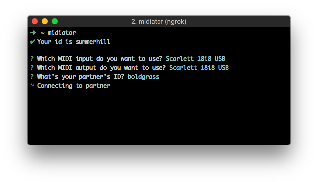

<p align="center"></p>

<h2 align="center">midiator</h2>

<p align="center"></p>

Remote into your friends' synths!

### Install

```
$ npm install -g midiator
```

### Usage

```
$ midiator
```

Midiator provides you with an ID which your friend can use to join your session.
You then choose your MIDI devices and type in your friend's code.
